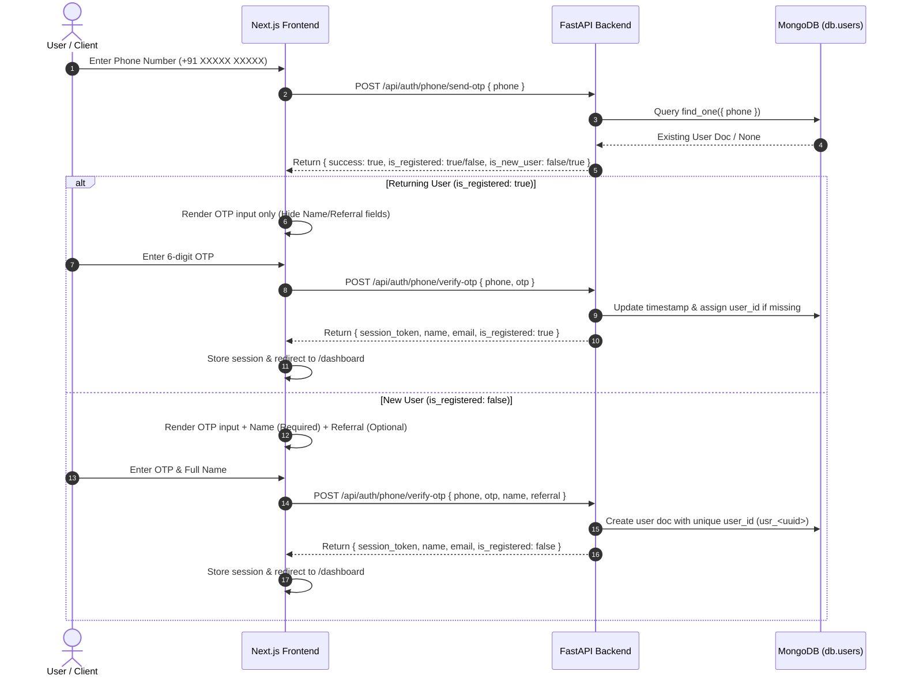

# Phone OTP Authentication & Returning User Flow — Walkthrough

## Summary of Changes

We have refactored the Phone OTP authentication flow across the FastAPI backend and Next.js frontend to eliminate redundant onboarding steps for returning users and fix database unique constraint issues.

---

## 1. Key Business Logic Flow

---

## 2. Detailed Change Logs

### Backend (`backend/main.py`)
1. **`/api/auth/phone/send-otp`**:
   - Queries `db.users` to check if `clean_phone` exists.
   - Includes boolean flags `is_registered` and `is_new_user` in the JSON response payload.
2. **`/api/auth/phone/verify-otp`**:
   - **Returning User Flow**: If phone exists in `db.users`, the backend bypasses name and referral requirements, retrieves existing profile data, updates `updated_at`, generates a secure session token, and returns user info with `is_registered: true`.
   - **New User Onboarding Flow**: If phone does not exist, the backend validates that `name` is provided (compulsory for registration) and generates a unique `user_id` (`usr_<uuid>`).
3. **MongoDB DuplicateKeyError Fix (`user_id: null`)**:
   - Ensured that every user document created or updated (across Phone OTP verification and Google OAuth callback) is assigned a unique `user_id` string (`usr_<16_hex_chars>`). This prevents MongoDB from generating `DuplicateKeyError` on indexed `user_id` fields.

### Frontend Service & Types (`src/services/authService.ts`)
1. Updated `SendOtpResponse` and `VerifyPhoneResponse` TypeScript interfaces with `is_registered?: boolean` and `is_new_user?: boolean` flags.
2. Maintained type safety across `sendPhoneOtp` and `verifyPhoneOtp` functions.

### Frontend Login UI (`src/app/login/page.tsx`)
1. Introduced `isRegistered` state (`boolean | null`) populated from `sendPhoneOtp()` API response.
2. **Conditional Rendering**:
   - **Returning User (`isRegistered === true`)**:
     - Screen Title: `"Verify code"`
     - Input Fields: OTP Code input only. Name and Referral fields are hidden.
     - CTA Button: `"Verify & Sign in"`
   - **New User (`isRegistered === false`)**:
     - Screen Title: `"Create profile"`
     - Input Fields: OTP Code input, Full Name input (compulsory, marked with red asterisk `*`), and Referral Code input (optional).
     - CTA Button: `"Verify & Create account"`
3. Styled using design tokens and clean form components consistent with `design.md`.

---

## 3. Verification & Compliance Check

| Requirement | Status | Details |
|---|---|---|
| Backend Query in `send-otp` | ✅ Passed | Checks `db.users` and returns `is_registered` flag |
| Direct Routing for Returning Users | ✅ Passed | Returning users bypass name/referral entry and enter `/dashboard` |
| Onboarding for New Users | ✅ Passed | Name field is compulsory for new users before submission |
| MongoDB `user_id` Null Key Fix | ✅ Passed | Generated `usr_<uuid>` on insert/update |
| Security & Error Handling | ✅ Passed | Input validated with Pydantic; raw stack traces hidden |
| TypeScript Type Safety | ✅ Passed | `npx tsc --noEmit` executed with 0 errors |
| Documentation & Memory Log | ✅ Passed | Created `walkthrough.md` and updated `memory.md` |

---

## 4. File Modification Summary

- [`backend/main.py`](file:///c:/PRACTICE/Acuspeak/Acuspeak_web/backend/main.py): Refactored `send_phone_otp` & `verify_phone_otp` endpoints and added `user_id` handling.
- [`src/services/authService.ts`](file:///c:/PRACTICE/Acuspeak/Acuspeak_web/src/services/authService.ts): Updated response interfaces.
- [`src/app/login/page.tsx`](file:///c:/PRACTICE/Acuspeak/Acuspeak_web/src/app/login/page.tsx): Updated phone OTP state and conditional form UI rendering.
- [`memory.md`](file:///c:/PRACTICE/Acuspeak/Acuspeak_web/memory.md): Appended change log entry.
- [`walkthrough.md`](file:///c:/PRACTICE/Acuspeak/Acuspeak_web/walkthrough.md): Documented architecture and walkthrough.
